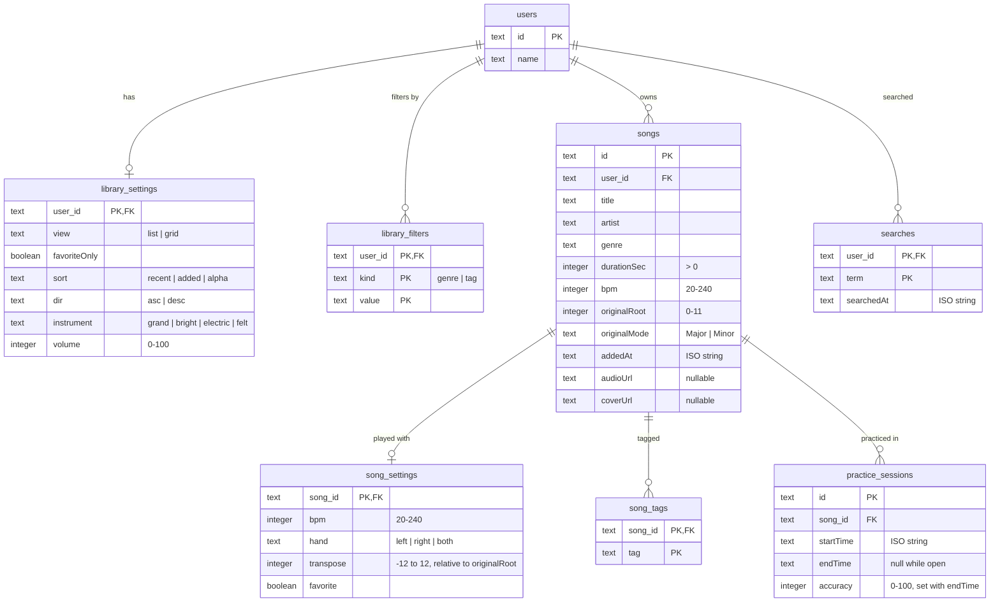

# Database schema

Generated from `migrations/0001_init.sql`. Open the Markdown preview in VS Code
(`Cmd+Shift+V`) with the **Markdown Preview Mermaid Support** extension
(`bierner.markdown-mermaid`) to render the diagram. Update this file when the
migration changes.

All foreign keys use `on delete cascade`, so deleting a song removes its
settings, tags and practice sessions.

## RPC functions

| Function | What it does |
| --- | --- |
| `create_song` | Inserts a `songs` row and its default `song_settings` row together. |
| `catalog_page` | Filters, sorts and pages the user's catalog in the database; returns the page's song ids, counts, and the user's genres and tags. |
| `update_song` | Applies a song patch (title, playback settings, tags) in one transaction. |
| `set_library_settings` | Applies a library settings patch, replacing filter rows, in one transaction. |
| `start_practice` | Locks the user, reuses any open session, else applies the settings patch and opens a new session. |
| `end_practice` | Sets `endTime` and `accuracy` on an open session; idempotent. |
